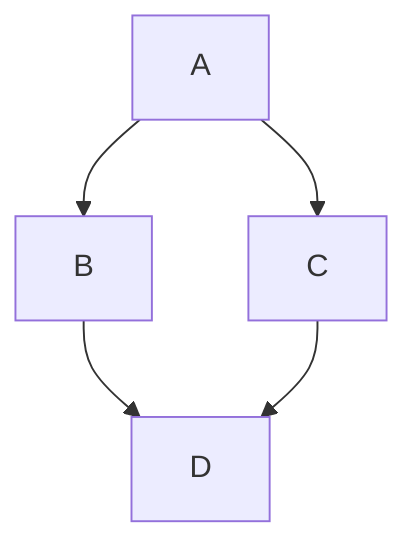
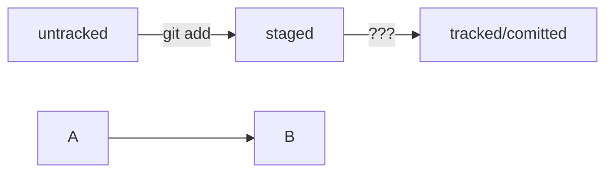

# Шпаргалка markdown
----

## Выделение текста

Вы можете выделять текст в markdown с помощью символов `_` или `*`. Например:

Пример _курсива_ и **жирного** текста.

----

## Заголовки

Заголовки можно создавать с помощью символа `#`. Чем больше `#`, тем меньше заголовок. Например:

# Заголовок первого уровня
## Заголовок второго уровня
### Заголовок третьего уровня

----

## Выделение кода

Чтобы выделить текст как код, поместите его в тройные кавычки:

```bash
mkdir my_project
cd my_project
git init
```

```java
import java.util.ArrayList;
import java.util.Scanner;

public class Practicum {
    
}

```


Это лишь некоторые функции markdown.

----


А тут начинается новый параграф


----

https://github.blog/developer-skills/github/include-diagrams-markdown-files-mermaid/



----




----

# Ветки в Git

Чтобы посмотреть все активные ветки в проекте, нужно вызвать команду `git branch` без аргументов.

Для сравнения веток есть команда `git diff`.

С помощью команды `git merge` можно слить две ветки в одну. 